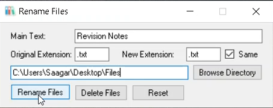

# Rename-Files

A basic C# program that takes a given directory and renames a group of files that are similar to one another in a convenient way. The user can even change the file extension if they wish.